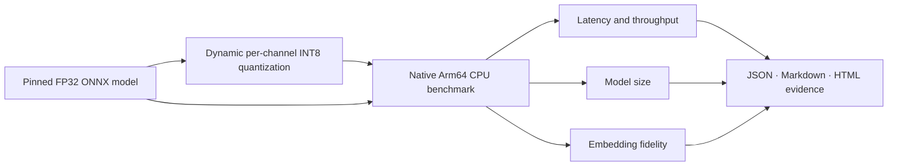

# ArmBench MiniLM

**One command turns a pinned FP32 sentence-embedding model into INT8 and produces reproducible performance and fidelity evidence on a native Arm64 runner.**

[](https://github.com/yhay81/armbench-minilm/actions/workflows/arm64-benchmark.yml)

ArmBench MiniLM is an entry for the **Cloud AI** track of the [Arm Create: AI Optimization Challenge](https://arm-ai-optimization-challenge.devpost.com/). It optimizes `sentence-transformers/all-MiniLM-L6-v2` with ONNX Runtime dynamic per-channel INT8 weight quantization, then checks whether the smaller model remains semantically faithful to the original.

## Why it exists

Optimization demos often stop at “the model is quantized.” This project creates an auditable chain of evidence:



The result is useful for semantic search, retrieval-augmented generation, clustering, and other CPU inference services where deployment size and predictable latency matter.

## Reproduce it

Requirements: Git, [uv](https://docs.astral.sh/uv/), and Python 3.11–3.13. No Hugging Face token or private dataset is required.

```bash
git clone https://github.com/yhay81/armbench-minilm.git
cd armbench-minilm
uv sync --frozen
uv run armbench-minilm all --work-dir .armbench --output-dir results
```

This command:

1. downloads the revision-pinned FP32 ONNX model;
2. creates the INT8 derivative locally;
3. benchmarks both models with identical ONNX Runtime settings;
4. evaluates representation drift on 32 authored sentences; and
5. writes `results/benchmark.json`, `results/report.md`, and `results/report.html`.

To reproduce the challenge machine exactly, fork this repository and run **Native Arm64 benchmark** from GitHub Actions. The workflow uses the public `ubuntu-24.04-arm` native Arm64 runner.

## Measured results

The [100-iteration native Arm64 run](https://github.com/yhay81/armbench-minilm/actions/runs/31405378460) used a four-core `ubuntu-24.04-arm` GitHub-hosted runner, ONNX Runtime 1.28.0, 10 warm-up iterations, and 100 measured iterations per model and batch.

| Batch | FP32 median | INT8 median | Speedup | INT8 throughput |
|---:|---:|---:|---:|---:|
| 1 | 2.928 ms | 1.629 ms | **1.80x** | 613.7 sentences/s |
| 8 | 19.331 ms | 7.376 ms | **2.62x** | 1,084.6 sentences/s |
| 32 | 74.264 ms | 23.815 ms | **3.12x** | 1,343.7 sentences/s |

Across the three batch sizes, INT8 delivered a **2.45x geometric-mean median-latency speedup**. The model file fell from 86.22 MiB to 56.04 MiB, a **35.0% reduction**, while mean corresponding-embedding cosine was **0.99267173** (minimum 0.97647780).

The exact machine-readable output and checksums are preserved in [`benchmarks/github-arm64-run-31405378460`](benchmarks/github-arm64-run-31405378460). The runner is a virtual machine; these values characterize this pinned workload and environment, not every Arm CPU.

## Method

| Choice | Value |
|---|---|
| Baseline | FP32 `onnx/model.onnx` from the pinned source revision |
| Optimization | ONNX Runtime dynamic, per-channel, signed INT8 weight quantization |
| Quantized operators | constant-weight `MatMul` and `Gemm` |
| Runtime | ONNX Runtime `CPUExecutionProvider` with graph optimizations enabled |
| Default threads | 4 intra-op, 1 inter-op |
| Default batches | 1, 8, and 32 sentences |
| Timing boundary | ONNX inference + attention-mask mean pooling + L2 normalization |
| Excluded from timing | model loading, tokenization, download, and quantization |
| Fidelity checks | row-wise embedding cosine and pairwise-similarity absolute error |

Every model/batch pair gets independent warm-up iterations followed by measured iterations. Throughput is derived from median batch latency. The final headline speedup is the geometric mean of the batch-level median-latency speedups.

## Commands

```bash
# Download and quantize only
uv run armbench-minilm prepare --work-dir .armbench

# Benchmark already prepared models
uv run armbench-minilm benchmark --work-dir .armbench --output-dir results

# Customize the workload
uv run armbench-minilm all --batch-sizes 1 16 64 --warmups 10 --iterations 50 --threads 4
```

Run local quality gates with:

```bash
uv run ruff check .
uv run ty check
uv run pytest
```

## Source and licensing

The source model is [`sentence-transformers/all-MiniLM-L6-v2`](https://huggingface.co/sentence-transformers/all-MiniLM-L6-v2), pinned to commit `1110a243fdf4706b3f48f1d95db1a4f5529b4d41` and licensed Apache-2.0. See [MODEL_PROVENANCE.md](MODEL_PROVENANCE.md) for the exact source path and transformation record.

ArmBench MiniLM's original code is MIT-licensed. Generated models are intentionally gitignored; create them from the pinned upstream file so the repository remains small and the transformation stays reproducible.

## Limitations

- The 32 benchmark sentences are authored workload samples, not a task-accuracy dataset.
- One clean CI machine does not represent every Arm processor or cloud configuration.
- Dynamic quantization performance depends on model shape, batch size, thread count, ONNX Runtime version, and hardware.
- This benchmark measures an embedding pipeline, not end-to-end search service latency.
- Fidelity metrics detect numerical drift but do not replace downstream task evaluation.

## Responsible use

This project handles general-purpose text embeddings and does not make high-stakes decisions. Benchmark results should be reproduced on the intended deployment hardware before capacity or cost decisions are made. Material AI assistance used to develop code and documentation is disclosed in the Devpost submission; all published measurements come from the executable workflow.
